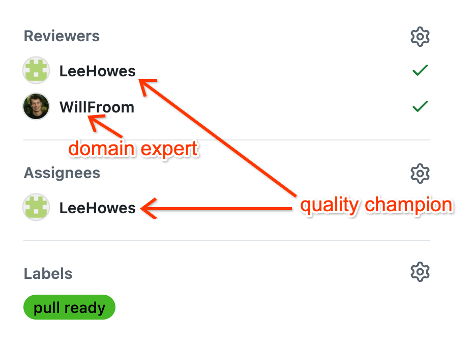

# Contributing to TorchTPU

Thank you for your interest in contributing to TorchTPU, we are happy to welcome
contributions! Before contributing, we ask that you read this document to
understand our process. The goal of this document is to describe how we work
together and to help us collaborate effectively, respect one another's time and
build a high-quality library.

We are looking to keep friction as low as possible for contributors while still
assuring maximum quality for our users. If any part of this process feels like
arbitrary box-checking that is not serving that goal, please open an issue so
that we can work on it.

## Philosophy on Contributions

We value your time and energy, and we ask that you value ours in return. We much
prefer small, well-tested contributions that address a single clear issue over
sprawling pull requests that try to solve multiple problems at once.

## Issue Reports

While pull requests fixing bugs or implementing features are always welcome,
they are by no means required. **Submitting a clear, well-isolated bug report or
feature issue is in itself a valuable contribution.**

For anything more complicated than trivial fixes, please open an issue first
before writing code, to allow for discussion about the right shape of the
solution and to make the issue discoverable and prevent duplicate work.

### What Makes a Great Bug Report

If you run into a bug or crash, please include:

*   **What happened vs. what you expected**: Clear reproduction steps and the
    full error traceback.
*   **Minimal Reproducible Example (MRE)**: A short script isolating the bug.
    Removing unrelated model logic makes diagnosis much faster.
*   **Environment details**: Your PyTorch version, `torch_tpu` version and TPU
    hardware generation if applicable.

## Before You Begin

### Sign Our Contributor License Agreement

Contributions to this project must be accompanied by a Google Contributor
License Agreement (CLA). You (or your employer) retain the copyright to your
contribution; signing simply gives us permission to redistribute your changes.

*   Visit <https://cla.developers.google.com/> to see your agreements or sign a
    new one.

If you have already signed the Google CLA for another open-source project, you
likely do not need to sign it again. A CLA bot checks pull requests
automatically and guides you if action is needed.

### Review Our Community Guidelines

This project follows
[Google's Open Source Community Guidelines](https://opensource.google/conduct/).
We treat all contributors with respect, warmth, and professionalism.

## Contribution Process

### Code Reviews

All submissions, including submissions by project members, require review. We
use
[GitHub pull requests](https://help.github.com/articles/about-pull-requests/)
for this purpose.

1.  When a PR is created, the **Google oncall** triages it and adds a **Google
    domain expert** as its **reviewer**.
1.  The **domain expert** reviews the PR, approves it, and then adds a **Google
    quality champion** as a reviewer AND the **assignee**.

    *   For now the domain expert needs to manually find a quality champion (one
        of `cbasile-g`, `LeeHowes`, `vladbelous`, and `zhanyong-wan`). Later
        we'll try to automate it.
    *   Use
        [this list](https://github.com/google-pytorch/torch_tpu/pulls?q=is%3Apr+is%3Aopen+repo%3Agoogle-pytorch%2Ftorch_tpu+-author%3Aapp%2Fcopybara-service+sort%3Aupdated-asc+draft%3Afalse)
        to balance the load between quality champions: try to pick someone who
        occurs fewer times in the "Assignee" column.
    *   See the image below for how the domain expert and quality champion roles
        map to the GitHub UI.

        
1.  The **Google quality champion** reviews the PR, focusing on style and
    quality, approves it, and then applies the `pull ready` label to the PR.
1.  The `pull ready` label triggers the bot to generate a CL from the PR:

    *   The **author** will be the bot.
    *   The **original author** will be the (external) PR author.
    *   The **reviewer** will be the Googler assigned the PR (the quality
        champion), who's responsible for approving the CL
    *   The Google domain expert and all other reviewers will be **CC**-ed.
    *   As long as the quality champion has approved the PR, anyone is allowed
        to apply the `pull ready` label in case the quality champion forgets to
        do so.
1.  By this time, the CL should most likely be ready. If, however, more changes
    are needed (e.g. due to presubmit failures), the Google domain expert is
    usually responsible for making such changes. They can pick one of two ways
    depending on the task:

    1.  **Patch the CL into a workspace**, iterate there, get approval from the
        quality champion, submit it, add a comment on the original PR with the
        commit SHA, and manually close the PR.
    1.  **Make changes to the PR's branch** (exact instructions to be
        documented), let the bot update the CL, iterate until the CL is ready,
        and get approval from the quality champion. The CL will auto submit, and
        the original PR will auto close.
1.  In rare cases, the internal testing of the CL may reveal an issue that
    requires a big change to the PR's design. The Google domain expert should
    work with the external contributor to address it, possibly via a new PR.

    *   If more changes are made to the original PR, a Google engineer will need
        to re-approve the PR for the changes to propagate to the CL.

Notes:

*   When a PR is ready for another review, click on the "Re-request review"
    (spinning arrows) button next to a reviewer name to notify them.
*   We want the quality champion's review to be in the open so that external
    contributors can learn Google's coding standard.
*   The bot-generated CL cannot be changed manually, but if you update the PR it
    is connected to, the bot will update it automatically, or the CL can be
    patched into a new workspace controlled by an internal user.

## Proposing Major Changes and API Design

While most changes start with an issue, non-trivial architectural changes or new
public APIs benefit from a Request for Comments (RFC) discussion before
implementation begins.

*   **API Philosophy**: We aim to make TorchTPU feel native to PyTorch. When
    contributing, prefer to extend standard PyTorch mechanisms (such as
    `torch.distributed` and `torch.compile`) rather than inventing
    hardware-specific wrappers.
*   **Stability Lifecycle**: New public APIs progress from internal, to
    experimental, and finally to stable. Once marked stable, APIs undergo a
    formal deprecation period before removal. To follow this process, create new
    APIs as internal — or experimental if intended to be used by consumers of
    TorchTPU — rather than stable.

## Policy on AI-Generated Code

We neither encourage nor discourage the use of AI assistants for generating
code, but we do have one firm policy no matter how the code was generated: **The
author is fully responsible for the code they submit.** This means:

*   **You must understand it**: If a reviewer asks why an operation is written a
    certain way, "an AI wrote it" is not an acceptable answer. Never submit code
    that you cannot explain and maintain yourself.
*   **You must validate it**: Ensure the code is correct, well-tested, and free
    of subtle bugs, regressions, or licensing violations.
*   **No automated low-effort submissions**: Pull requests that appear to be
    unreviewed, automated LLM output waste reviewer time and will be closed.
    Please expect to spend at least as much time preparing your code for
    submission as you expect maintainers to spend reviewing it.
*   **Optional attribution**: If an AI assistant provided meaningful help, you
    may add an `Assisted-by:` tag in your commit message. AI assistants should
    not be considered co-authors on any commits.

To minimize the maintenance burden imposed by people who do *not* follow these
rules, we may limit the number of PRs a contributor can open at one time. If
this causes problems for you and you have a record of consistently making
high-quality contributions, please reach out to us and we will try to find a
solution.

## Review Expectations

A constructive review process relies on mutual respect for time and attention.

### What You Can Expect From Maintainers

*   **Thoughtful feedback**: We review code for correctness, clarity, and long-
    term maintainability, focusing on the problem rather than the person.
*   **Commitment to main branch stability**: We follow a strict revert-on-
    breakage policy so our main branch remains dependable for everyone.
*   **Up-to-date contribution documentation**: All requirements for contribution
    should be well-documented and clearly explained. If you encounter unclear or
    missing documentation, we encourage you to file an issue about it.

### What We Expect From Contributors

*   **Small, focused PRs**: Submit pull requests that do one thing well. A
    concise 100-line diff gets reviewed far faster than a 1,000-line rewrite.
*   **Clear context**: Explain what your change does and why it is needed. Link
    to the relevant GitHub issue.
*   **Shepherd your change**: Keep an eye on CI checks, address reviewer notes,
    and let us know if you get blocked or need to step away.

## Reporting Security Vulnerabilities

If you discover a potential security vulnerability in TorchTPU, please report it
privately rather than opening a public GitHub issue.

*   **How to report**: Use GitHub's private vulnerability reporting form at
    <https://github.com/google-pytorch/torch_tpu/security/advisories/new> (or
    navigate to the **Security** tab of our repository and select **Report a
    vulnerability**).
*   **Scope**: High memory usage, crashes caused by invalid inputs, or numerical
    divergence from untrusted models are normal bugs rather than security
    vulnerabilities. Running untrusted model code is equivalent to running
    untrusted arbitrary Python code.
