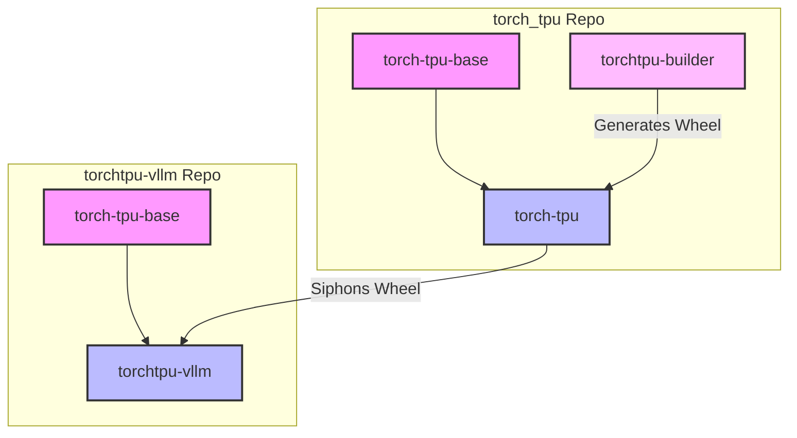

# Torch-TPU and vLLM Docker Build Architecture

This document describes the decoupled Docker build strategy for `torch_tpu` and
`torchtpu-vllm` projects.

## Overview

To optimize build times and ensure consistent environments, we use a multi-stage
build approach that separates the heavy dependency installation from the
volatile code changes.

## The Three Images

1.  **`torch-tpu-base`**: A clean base image containing Python 3.12 and all
    heavy dependencies (PyTorch, JAX, libtpu, etc.). This image is stable and
    changes infrequently.
1.  **`torch-tpu`**: The final image produced by the `torch_tpu` repository. It
    builds the `torch_tpu` wheel from source and installs it. It also exposes
    the wheel file for other projects to use.
1.  **`torchtpu-vllm`**: The image produced by the `torchtpu-vllm` repository.
    It inherits from `torch-tpu-base` and siphons the compiled wheel from
    `torch-tpu` to avoid rebuilding it or inheriting build-time overhead.

## Interaction & Artifact Sharing

The following diagram illustrates how these images interact and share artifacts:

### Build Workflow

1.  **Build Base**: The `base` stage is built from `Dockerfile.multistage` to
    produce `torch-tpu-base:latest`.
1.  **Build Torch-TPU**: The full `Dockerfile.multistage` is built to produce
    `torch-tpu:latest`. This image contains the wheel at `/opt/wheels/`.
1.  **Build vLLM**: The `torchtpu-vllm` Dockerfile pulls `torch-tpu:latest` as
    an artifact source and copies the wheel out of it.

This setup ensures that changes to `torch_tpu` code only require rebuilding the
wheel and re-running the last few steps of the `vllm` build, keeping iteration
times fast.
