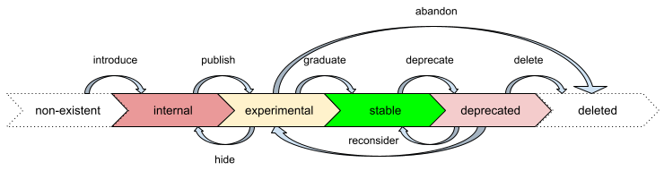

# TorchTPU API Policy

**TL;DR:** try to avoid new APIs; when we really need one, limit access unless
we are ready to commit to it long-term.

This document defines the policy for adding and changing TorchTPU APIs. It's an
extension to
[PyTorch's API policy](https://docs.pytorch.org/executorch/stable/api-life-cycle.html):
by default, we inherit from that policy; therefore this document focuses on the
differences.

For the most part, the best API is no API: any API that TorchTPU introduces adds
some cognitive burden to the users and makes it harder for them to switch
accelerator types. Therefore, if there's already a PyTorch API that can get us
what we want, we should usually just implement that API for the TPU backend.

Sometimes, however, we have no choice but to add a new API. In such cases, we
should limit the access to the API by default, and only allow users to use it
when we are committed to supporting it. Once we are committed to an API,
removing it or changing it in a backward-incompatible way requires a deprecation
process.

## Life of an API

An API typically progresses through several stages in its lifecycle:

We borrowed the above model from PyTorch, with the notable addition of the
**internal** stage to provide more clarity.

There's no expectation that an API will eventually progress to a new stage - for
example, some APIs may stay internal indefinitely.

*   When an API is first introduced, it typically starts in the internal stage.
    While in this stage, the API is unstable and may change without notice.
    Internal APIs are clearly marked. Users are advised to not use them. If they
    do use them, the program may have undefined behavior.
*   After we gain some confidence with an internal API, we may expose it to
    users and clearly mark it as **experimental**. An API in this stage may
    still change or be deleted, but users are allowed to use it. If it is
    changed or deleted, the users are expected to update their uses to
    accommodate for the change (the TorchTPU team will provide a migration
    guide, but has no other obligations). An experimental API may also be hidden
    and become internal at any time.
*   When we are ready to support an experimental API in the long term, we mark
    it as **stable**. Once in this stage, backward-incompatible changes and
    deletion are discouraged and must go through a deprecation process.
*   To deprecate an API, we must first mark it as **deprecated** and wait for at
    least 2 minor releases before changing/deleting it (e.g. if we deprecate an
    API in 2.13, we can delete it in 2.15 or later). When there is sufficient
    evidence to reconsider a deprecated API, it may be marked experimental or
    stable and become no longer deprecated.

## Marking the APIs

### Principle

The principle is that when we change the state of an API between experimental,
stable, and deprecated, the user code shouldn't need to be changed.

*   **Internal** APIs
    *   Command-line flags should start with `torch_tpu_internal_`.
    *   Environment variables should start with `TORCH_TPU_INTERNAL_`.
    *   Python APIs should either start with `_` or be in a module that starts
        with `_`.
*   **Experimental** APIs
    *   No command-line flags should be allowed as experimental APIs.
    *   Environment variables should start with `TORCH_TPU_`. If the user sets
        them, it will trigger a one-time warning at run time.
    *   Python APIs should be in the `torch.tpu` or `torch.accelerator`
        (preferred) package and be marked with a `TORCH_WARN_ONCE()` in C++ or
        `warnings.warn()` in Python so that using them will trigger a one-time
        warning at run time.
*   **Stable** APIs
    *   No command-line flags should be allowed as stable APIs.
    *   Environment variables should start with `TORCH_TPU_`, not
        `TORCH_TPU_INTERNAL_`.
    *   Python APIs should usually be in the `torch.tpu` or `torch.accelerator`
        (preferred) package.
*   **Deprecated** APIs
    *   They will retain their stable API names, but their implementations will
        trigger a `TORCH_WARN_ONCE()` / `warnings.warn()` deprecation warning at
        run time.

### Implementation

*   To mark an environment variable:
    *   **internal**: name it `TORCH_TPU_INTERNAL_*`
    *   **experimental** / **stable** / **deprecated**: add it to
        `kEnvVarToStage` as `SymbolStage::Experimental()`,
        `SymbolStage::Stable()`, or `SymbolStage::Deprecated()` in
        `torch_tpu/csrc/common/env_vars.h`.
*   To mark a command-line flag:
    *   *All* flags must be **internal** and start with `torch_tpu_internal_`.
*   To mark a Python class or function (including enum class) :
    *   **internal**: start the name with `_`.
    *   **experimental** / **stable** / **deprecated**: use the corresponding
        decorator in `torch_tpu._internal.utils.annotations`
        ([examples](https://github.com/search?q=repo%3Agoogle-pytorch%2Ftorch_tpu+%2F%40%28annotations%5C.%29%3F%28experimental%7Cstable%7Cdeprecated%29%2F+lang%3Apy&type=code)).
*   To mark a non-callable Python attribute (including enum constants and
    module/class variables):
    *   **internal**: start the name with `_`.
    *   **experimental** / **stable** / **deprecated**: add an entry in
        `__tt_api_stages__` in the module
        ([examples](https://github.com/search?q=repo%3Agoogle-pytorch%2Ftorch_tpu+%2F__tt_api_stages__.*%3D%2F+lang%3Apy&type=code)).
*   To mark a C++ type bound to Python via pybind11:
    *   **internal**: start the name with `_`.
    *   **experimental** / **stable** / **deprecated**: use the corresponding
        wrapper function in `torch_tpu._internal.utils.annotations`
        ([examples](https://github.com/search?q=repo%3Agoogle-pytorch%2Ftorch_tpu+%2F%5B%5E%40.%5D%5Cb%28experimental%7Cstable%7Cdeprecated%29%5C%28%2F+lang%3Apy&type=code)).
*   To mark a C++ function/lambda/value bound to Python via `PYBIND11_MODULE`:
    TODO: add instructions.
*   To mark a custom op in `torch.ops.tpu`:
    *   **internal**: start the name with `_`.
    *   **experimental** / **stable** / **deprecated**: use the
        `ImplExperimental`/`ImplStable`/`ImplDeprecated` functions
        ([examples](https://github.com/search?q=repo%3Agoogle-pytorch%2Ftorch_tpu+%2F%5Cb%28ImplExperimental%7CImplStable%7CImplDeprecated%29%5Cb%2F+lang%3Ac%2B%2B&type=code)).

## Documentation

User-facing documentation should not mention internal APIs. It should describe
experimental, stable, and deprecated APIs and make it clear which stage each of
them is in.

## References

*   PyTorch Core's public API policy:
    [Public API definition and documentation](https://github.com/pytorch/pytorch/wiki/Public-API-definition-and-documentation)
    (the North star, not the reality)
*   [PyTorch's Python Frontend Backward and Forward Compatibility Policy](https://github.com/pytorch/pytorch/wiki/PyTorch%27s-Python-Frontend-Backward-and-Forward-Compatibility-Policy)
    (the North star, not the reality)
*   [ExecuTorch's API policy](https://docs.pytorch.org/executorch/stable/api-life-cycle.html)
    (not used by PyTorch Core, for reference only)
