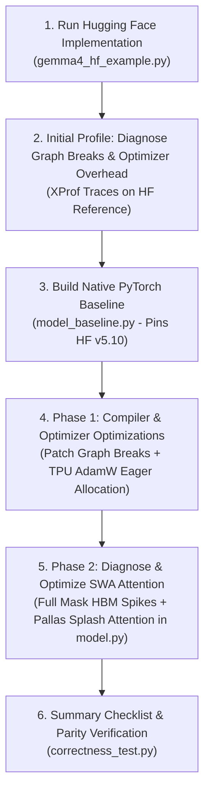
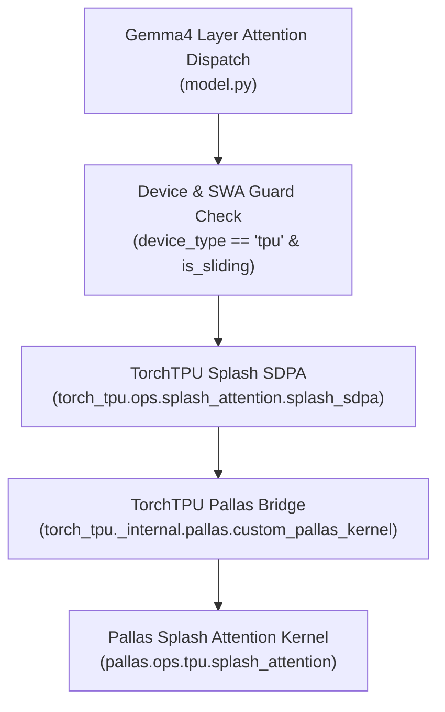

# Case Study: Profiling & Optimizing PyTorch Models on TPU with XProf (Gemma4)

This tutorial provides a step-by-step methodology for taking a PyTorch model
running under `torch.compile` mode on TPU, identifying hardware bottlenecks
using **XProf**, and implementing TPU-focused optimizations incrementally.

We use **Gemma4** as a case study to demonstrate the optimization workflow:
starting from a Hugging Face reference implementation
([`gemma4_hf_example.py`](gemma4_hf_example.py)), profiling to diagnose initial
compiler & optimizer bottlenecks, building a native PyTorch baseline
([`model_baseline.py`](model_baseline.py)) to pin the HF version (`transformers`
v5.10), resolving compiler & optimizer bottlenecks first, and then profiling &
engineering TPU-fused SWA attention kernel optimizations
([`model.py`](model.py)).

> **Note**: Unless specified otherwise, all metrics, XProf profiles, and
> execution traces throughout this tutorial are measured with **Batch Size = 4**
> and **Sequence Length = 1024**, and all metrics gathered are post-warmup
> values with two steps.

--------------------------------------------------------------------------------

## 1. The Optimization Workflow



--------------------------------------------------------------------------------

## 2. Step 1: Starting with the Hugging Face Implementation

When porting or benchmarking a model on TPU, begin by running the canonical
Hugging Face `transformers` implementation
([`gemma4_hf_example.py`](gemma4_hf_example.py#L41-L46)):

```python
# Instantiate Hugging Face Gemma4 reference model (transformers v5.10)
config_path = model_configs.create_path_for_model_id("google/gemma-4-e2b")
config = transformers.AutoConfig.from_pretrained(config_path)
model_hf = transformers.AutoModelForCausalLM.from_config(config)
```

Running the standard Hugging Face model provides a ground-truth numerical
reference for checking correctness and output parity across target hardware
backends.

--------------------------------------------------------------------------------

## 3. Step 2: Initial Profiling & Diagnosing Compiler & Optimizer Bottlenecks

We next run tests and capture XProf execution traces on the Hugging Face
reference model (using `torch_tpu` profiling). Comparing initial TorchTPU
execution traces against a native JAX training run highlights compiler graph
fragmentation and overhead:


*Figure 1: Initial TorchTPU Training Trace on Hugging Face reference model. Note
the 712.55 ms graph break between the backwards pass and the optimizer.*

 *Figure 2: JAX
Training Trace reference.*

Initial trace profiling reveals key inefficiencies:

1.  **Optimizer Graph Breaks under Dynamo**:

    *   *Problem*: Standard PyTorch optimizer steps trigger unconditional graph
        breaks during PyTorch Dynamo execution due to internal Python decorators
        and interceptors.
    *   *Effect*: Host execution fallbacks during optimizer steps, fragmenting
        end-to-end compiled execution graphs.

2.  **Dynamic Memory Allocation during Optimizer Step**:

    *   *Problem*: Dynamic lazy allocation of optimizer state tensors
        (`exp_avg`, `exp_avg_sq`) during early training iterations.
    *   *Effect*: HBM memory allocation delays and recompilation events during
        early optimizer step calls.

--------------------------------------------------------------------------------

## 4. Step 3: Building the Native PyTorch Baseline

To prevent upstream changes in Hugging Face (`transformers` v5.10) from
inadvertently affecting our benchmark, we construct a clean, native PyTorch
baseline ([`model_baseline.py`](model_baseline.py)).

By pinning the HF reference behavior in a standalone PyTorch implementation, we
establish a stable baseline for direct XProf bottleneck diagnosis and targeted
incremental optimization.

--------------------------------------------------------------------------------

## 5. Step 4: Phase 1 Optimization — Resolving Compiler & Optimizer Overhead

In the first phase of optimization, we target compiler graph compilation
continuity and optimizer memory pre-allocation based on our initial diagnosis.

### 4a. Eliminating Optimizer Graph Breaks (`patch_optimizer_graph_breaks`)

By default, PyTorch's internal `_use_grad_for_differentiable` decorator inserts
an explicit `torch._dynamo.graph_break()` inside optimizer `.step()` calls.
Under `torch.compile` or PyTorch Dynamo execution on TPU, this causes the
compiled execution trace to fall back to Python host execution on every
optimizer update.

To eliminate these graph breaks without modifying PyTorch core binaries,
`torch_tpu` implements a dynamic patching utility
[`patch_optimizer_graph_breaks`](../../_internal/optim/patch.py#L112-L168) that
replaces PyTorch's standard `_use_grad_for_differentiable` decorator with a
Dynamo-safe context wrapper:

```diff
# Diff: PyTorch Standard vs TorchTPU Safe Optimizer Decorator
-def _use_grad_for_differentiable(func):
-    def _use_grad(*args, **kwargs):
-        import torch._dynamo
-        self = args[0]
-        prev_grad = torch.is_grad_enabled()
-        try:
-            torch.set_grad_enabled(self.defaults["differentiable"])
-            torch._dynamo.graph_break()  # Explicit graph break!
-            ret = func(*args, **kwargs)
-        finally:
-            torch.set_grad_enabled(prev_grad)
-        return ret
-    return _use_grad
+def use_grad_for_differentiable(func):
+    @functools.wraps(func)
+    def wrapper(*args, **kwargs):
+        self = args[0]
+        prev_grad = torch.is_grad_enabled()
+        try:
+            torch.set_grad_enabled(self.defaults.get("differentiable", False))
+            # Graph break removed to allow end-to-end TPU Dynamo compilation
+            ret = func(*args, **kwargs)
+        finally:
+            torch.set_grad_enabled(prev_grad)
+        return ret
+    return wrapper
```

```python
# Usage in Gemma4 Training Pipeline:
import torch
import torch_tpu
from torch_tpu._internal.optim.patch import patch_optimizer_graph_breaks

# 1. Apply patch prior to compiling model or constructing optimizer
patch_optimizer_graph_breaks()

# 2. Instantiate model & standard PyTorch optimizer
model = MyGemma4Model().to("tpu")
optimizer = torch.optim.AdamW(model.parameters(), lr=1e-4)

# 3. Train step inside torch.compile - step() now stays inside the compiled XLA graph
@torch.compile
def train_step(input_ids, labels):
    optimizer.zero_grad()
    outputs = model(input_ids)
    loss = compute_loss(outputs, labels)
    loss.backward()
    optimizer.step()  # No graph break! Executed seamlessly on TPU.
    return loss
```

*   **Compiler Benefit**: Preserves full end-to-end XLA graph compilation across
    optimizer update steps without falling back to host Python execution.

### 4b. TPU-Optimized Eager State Pre-allocation (`AdamW`)

Standard PyTorch `torch.optim.AdamW` initializes optimizer state tensors
(`exp_avg`, `exp_avg_sq`) lazily during the first `.step()` call. On TPU
backends under `torch.compile`, this causes runtime dynamic memory allocation
spikes and triggers PyTorch Dynamo graph breaks when Dynamo intercepts standard
`_init_group` calls.

To prevent runtime allocation latency and Dynamo graph breaks, `torch_tpu`
provides a TPU-optimized [`AdamW`](../../_internal/optim/adamw.py#L26-L82)
implementation that eagerly allocates state tensors on the target device during
`__init__` and replaces `_init_group` with `_my_init_group`:

```diff
# Diff: Standard PyTorch AdamW vs TorchTPU Eager State Pre-allocation AdamW
 class AdamW(torch.optim.AdamW):
+    def __init__(self, *args, **kwargs):
+        super().__init__(*args, **kwargs)
+        self._eager_init_state()  # Pre-allocates optimizer states eagerly on TPU
+
+    def _eager_init_state(self):
+        for group in self.param_groups:
+            for p in group["params"]:
+                if p.requires_grad:
+                    state = self.state[p]
+                    if len(state) == 0:
+                        state["step"] = torch.zeros((), dtype=torch.float32, device=p.device)
+                        state["exp_avg"] = torch.zeros_like(p)
+                        state["exp_avg_sq"] = torch.zeros_like(p)

-    def _init_group(self, group, params_with_grad, ...):
+    def _my_init_group(self, group, params_with_grad, ...):
+        # Renamed method prevents PyTorch Dynamo from intercepting parameter mutations
```

```python
# Usage in Gemma4 Training Pipeline:
from torch_tpu._internal.optim.adamw import AdamW

# Pre-allocate optimizer state tensors (exp_avg, exp_avg_sq) eagerly on TPU
optimizer = AdamW(model.parameters(), lr=1e-4)
```

*   **Memory Benefit**: Eagerly pre-allocates optimizer state tensors on TPU
    device memory during initialization, avoiding dynamic runtime memory
    allocation spikes, recompilations, and Dynamo `_init_group` graph breaks.


*Figure 3: TorchTPU Training Trace after applying optimizer optimizations,
demonstrating unbroken end-to-end compiled XLA graph execution across the
forward pass (left), backward pass (middle), and optimizer updates (right).*

#### Phase 1 Optimization Performance Comparison (AdamW Graph Break Fix):

| Metric /       | Baseline   | After   | Improvement | JAX       | % vs JAX |
: Implementation : (HF        : AdamW   :             : Reference :          :
:                : Reference) : Graph   :             :           :          :
:                :            : Break   :             :           :          :
:                :            : Fix     :             :           :          :
| :------------- | :--------- | :------ | :---------- | :-------- | :------- |
| Step Time (ms) | 882.741    | 167.348 | 5.27x       | 109.517   | 152.8%   |
| Peak Memory    | 91.1       | 91.1    | 1.0x        | 48.2      | 189.0%   |
: (GB)           :            :         :             :           :          :

--------------------------------------------------------------------------------

## 6. Step 5: Phase 2 Optimization — Diagnosing & Resolving Attention Bottlenecks

After eliminating optimizer graph breaks and dynamic memory allocation in Phase
1, we still observe regressions compared to JAX. We re-profile training memory
traces under XProf to find more inefficiencies. Comparing TorchTPU memory traces
against a native JAX training run highlights an elevated peak memory footprint:


*Figure 4: TorchTPU Memory Training Profile prior to attention optimization,
showing elevated peak memory allocations.*

 *Figure 5:
JAX Memory Training Profile reference.*


*Figure 6: TorchTPU Forward Trace Base execution profile highlighting the
forward pass computation sequence.*

 *Figure 7: JAX Forward
Trace reference execution profile.*

 *Figure 8:
TorchTPU Memory Forward Profile baseline during the model forward pass prior to
attention kernel optimization.*

 *Figure 9: JAX
Memory Forward Profile reference.*

### 5a. Diagnosing SWA Attention Bottlenecks in XProf

With optimizer overheads removed, inspecting the native baseline implementation
([`model_baseline.py`](model_baseline.py#L308-L330)), our custom SWA
implementation ([`tpu_attention.py`](tpu_attention.py#L42-L110)), and the
forward execution traces (Figures 6–9) highlights three specific hardware
inefficiencies within the Sliding Window Attention (SWA) layer:

```python
# Native PyTorch Baseline SWA: Explicit 2D Indexing & Mask Allocation
num_key_value_groups = self.num_heads // self.current_kv_heads
if num_key_value_groups > 1:
    key_states = key_states.repeat_interleave(num_key_value_groups, dim=1)
    value_states = value_states.repeat_interleave(num_key_value_groups, dim=1)

indices = torch.arange(seq_len, device=query_states.device)
allowed = (indices.unsqueeze(0) <= indices.unsqueeze(1)) & (
    indices.unsqueeze(0) > indices.unsqueeze(1) - self.config.sliding_window
)
swa_mask = torch.where(allowed, 0.0, float('-inf')).view(1, 1, seq_len, seq_len)

attn_output = F.scaled_dot_product_attention(
    query_states, key_states, value_states, attn_mask=swa_mask, scale=1.0
)
```

1.  **Full Mask Usage & HBM Allocation Spikes**:

    *   *Problem*: Materializing a full O(S^2) 2D mask matrix (`swa_mask`)
        across sequence length S forces elementwise mask condition checks across
        all matrix dimensions, significantly increasing the total number of
        operations and HBM memory allocation overhead.
    *   *Effect*: High memory allocation events in during mask creation
        (`torch.where`), frequent HBM read/write traffic during attention mask
        creation, and increased op counts from running computations on full mask
        dimensions.

2.  **Un-fused Memory Operations**:

    *   *Problem*: `key_states.repeat_interleave(...)` copies Key/Value tensors
        in memory to expand GQA heads before attention calculation.
    *   *Effect*: Separate memory copy operations consume execution time prior
        to core matrix multiplication kernels.

3.  **Kernel Fragmentation**:

    *   *Problem*: Standard PyTorch `F.scaled_dot_product_attention` falls back
        to separate elementwise and matrix ops rather than leveraging TPU SRAM
        block tiling.
    *   *Effect*: Multiple fragmented XLA computation slices instead of a single
        fused execution block.

### 5b. Pallas Splash Attention Kernel Fusing (`model.py`)

To resolve these attention bottlenecks, we integrate **Pallas Splash Attention**
directly into the native model's attention layer
([`model.py`](model.py#L313-L344)) which fixes the three issues above:



#### Attention Dispatch & Kernel Invocation ([`model.py`](model.py#L313-L344)):

```python
# 1. Device and SWA compatibility check
use_splash = (
    splash_attention is not None
    and query_states.device.type == 'tpu'
    and self.is_sliding
    and not skip_sliding_mask
    and attention_mask is None
)

if use_splash:
    enable_gqa = self.num_heads != self.current_kv_heads

    # 2. Invoke Pallas Splash Attention with implicit windowing and on-the-fly GQA
    attn_output = splash_attention.splash_sdpa(
        query_states,
        key_states,
        value_states,
        scale=1.0,
        is_causal=True,
        local_window_size=self.config.sliding_window - 1,
        enable_gqa=enable_gqa,
        block_q=1024,
        block_kv=1024,
        block_dkv=1024,
    )
    attn_output = attn_output.transpose(1, 2).contiguous().view(bsz, seq_len, -1)
    return self.o_proj(attn_output), None
```

*   **Architectural Benefits**:
    *   **Implicit Windowing**: Sliding window boundaries are enforced directly
        during SRAM block tile loading
        (`local_window_size=self.config.sliding_window - 1`)—no O(S^2) HBM mask
        tensor is allocated, eliminating elementwise full mask operation
        overhead.
    *   **Fused GQA**: Head broadcasting (`enable_gqa=True`) occurs on-the-fly
        inside the TPU Vector Processing Unit (VPU).
    *   **Block Tiling**: Computations are tiled into `1024x1024` blocks
        tailored for TPU Matrix Units (MXU).

#### Post-Optimization Forward Traces:


*Figure 10: TorchTPU Forward Trace Optimized profile showing fused Splash
Attention execution on TPU.*


*Figure 11: TorchTPU Memory Forward Optimized profile after linking Splash
Attention kernel, demonstrating reduced memory allocation.*

#### Post-Optimization Training Traces:


*Figure 12: TorchTPU Training Trace with SWA optimizations applied, achieving a
142.02 ms step time by eliminating full attention mask allocation overhead and
fusing attention operations.*


*Figure 13: TorchTPU Memory Training Profile with SWA optimizations applied,
reducing peak training memory usage from 91.1 GB down to 62.95 GB.*

#### Forward Pass Performance Comparison:

| Metric /       | Baseline | After SWA | Improvement | JAX       | % vs JAX |
: Implementation : (Native) : Attention :             : Reference :          :
:                :          : Fix       :             :           :          :
| :------------- | :------- | :-------- | :---------- | :-------- | :------- |
| Forward Pass   | 33.892   | 25.209    | 1.34x       | 29.394    | 85.8%    |
: Time (ms)      :          :           :             :           :          :
| Peak Memory    | 12.84    | 5.2       | 2.47x       | 31.07     | 16.7%    |
: (GB)           :          :           :             :           :          :

#### Training Performance Comparison:

Metric / Implementation | Baseline (HF Reference) | After AdamW Graph Break Fix | After SWA Attention Fix | Improvement         | JAX Reference | % vs JAX
:---------------------- | :---------------------- | :-------------------------- | :---------------------- | :------------------ | :------------ | :-------
Step Time (ms)          | 882.741                 | 167.348                     | 142.018                 | 6.22x (1.18x incr.) | 109.517       | 129.7%
Peak Memory (GB)        | 91.1                    | 91.1                        | 62.95                   | 1.45x               | 48.2          | 130.6%

--------------------------------------------------------------------------------

## 7. Next Steps and Disclaimers

Removing the graph breaks and implementing the Sliding Window attention allows
us to beat JAX in the forward pass while we are most of the way to parity in
training. However, there are still further opportunities for optimization that
can be identified, especially relating to the backwards pass. First, there can
be more efficient operation fusion that can be implemented. In addition, between
the forward and backwards pass, there is a large number of copy operations in
the fill step that could be optimized out as well. Outside of this, there can be
several further optimizations that can be found by further observation of the
traces.

These examples are not meant to be representative of the state of the art. The
JAX implementation is more optimal at higher batch sizes and sequence lengths
which TorchTPU OOMs at, so further investigation is left to the reader.

--------------------------------------------------------------------------------

## 8. Summary Checklist For Gemma 4

-   [ ] **HF Reference & Native Baseline**: Start with canonical HF reference
    ([`gemma4_hf_example.py`](gemma4_hf_example.py)) and build a native baseline
    ([`model_baseline.py`](model_baseline.py)) to pin version semantics.
-   [ ] **Initial Profiling & Fixes**: Profile under XProf, then apply
    `patch_optimizer_graph_breaks()` and TPU-optimized `AdamW`
    (`torch_tpu._internal.optim.adamw.AdamW`) to eliminate graph breaks and
    pre-allocate state tensors eagerly on TPU device memory.
-   [ ] **Re-profile Core Kernels**: Re-profile under XProf after compiler fixes
    to isolate attention memory footprint bottlenecks (such as O(S^2) where S is
    sequence length and full mask allocation spikes).
-   [ ] **Fuse Attention Kernels**: Use Pallas Splash SDPA (`splash_sdpa`) to
    eliminate O(S^2) full mask allocation and fuse GQA head broadcasting
    on-the-fly.
-   [ ] **Verify Numerical Parity**: Run automated tests
    ([`correctness_test.py`](correctness_test.py)) to ensure output parity
    across Hugging Face, baseline, and TPU implementations.
